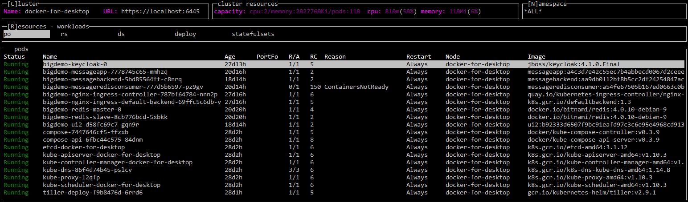

# kubexp (KubeExplorer)

[](https://circleci.com/gh/alitari/kubexp)
[](https://codecov.io/gh/alitari/kubexp)

kubexp is a console user interface for [kubernetes](https://kubernetes.io/).



### Features

- automatic update view when cluster changes
- switch cluster
- resource details and incremental search
- following container logs
- exec into container
- pod port-forward
- upload/download files to container
- scale deployments, replicasets etc.
- delete resources

## Installation

### rbac

Your [service account](https://kubernetes.io/docs/tasks/configure-pod-container/configure-service-account/) must have a rolebinding to cluster admin in each k8s cluster. The file [rbac-default-clusteradmin.yaml](./rbac-default-clusteradmin.yaml) contains the according [clusterrolebinding](<(https://kubernetes.io/docs/admin/authorization/rbac/#kubectl-create-clusterrolebinding)>) for the default service account:

```bash
kubectl apply -f rbac-default-clusteradmin.yaml
```

### Option 1: get executable

Go to [releases page](https://github.com/alitari/kubexp/releases) and download the binary for your platform.

```bash
KUBEXP_RELEASE="v0.6.1"
wget https://github.com/alitari/kubexp/releases/download/${KUBEXP_RELEASE}/kubexp
chmod +x kubexp
```

### Option 2: running with docker

To run the kubexp container you need to mount the config file. Note, that when kubexp runs in a container the port-forward feature will not work.

```bash
KUBEXP_RELEASE="v0.6.1"
docker run -it -v ~/.kube/config:/root/.kube/config alitari/kubexp:${KUBEXP_RELEASE}
```

## Hints

- use **arrow** keys to navigate and **return** key to toggle between the item list and item details
- to get help in the user interface type **'h'**
- hit **Space**-Key to reconnect when resource is OFFLINE
- get command line options with `kubexp -help`

## building and running

set the GOOS environment variable according your os

```bash
# setup development environment
SRCDIR=${GOPATH:-${HOME}/go}/src/github.com/alitari/ && mkdir -p $SRCDIR && cd $SRCDIR
git clone https://github.com/alitari/kubexp.git && cd kubexp
# fetch dependencies
go get -v -t -d ./...

export GOOS="linux"
# export GOOS="windows"
# build executable
./build.sh bin
# execute linux
bin/kubexp
# execute windows
# bin/kubexp.exe

# execute tests
go test main/..
```

## Credits

- [GOCUI](https://github.com/jroimartin/gocui) go framework for console user interfaces
