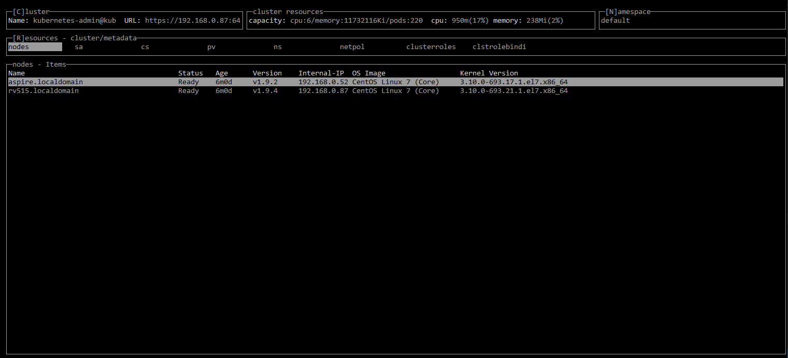

# kubexp (KubeExplorer)

[](https://circleci.com/gh/alitari/kubexp)
[](https://codecov.io/gh/alitari/kubexp)

kubexp is a console user interface for [kubernetes](https://kubernetes.io/). The main purpose of this tool is to enable a fast and efficient access to kubernetes cluster resources.



see more features [here](./gifs/features.md)

## Setup

### rbac

Your [service account](https://kubernetes.io/docs/tasks/configure-pod-container/configure-service-account/) must have a rolebinding to cluster admin in each k8s cluster. The file [rbac-default-clusteradmin.yaml](./rbac-default-clusteradmin.yaml) contains the according [clusterrolebinding]((https://kubernetes.io/docs/admin/authorization/rbac/#kubectl-create-clusterrolebinding)) for the default service account:

```bash
kubectl apply -f rbac-default-clusteradmin.yaml
```

### configure clusters

kubexp uses `~/.kube/config` to read the k8s contexts. The user of a context *must* have a token defined:

```yaml
apiVersion: v1
clusters:
...
contexts:
...
users:
- name: ...
  user:
    # this line is needed!
    token: eyJhbGciOiJSUzI1NiIsInR5cCI6IkpXVCJ9....
...
```

Having access to your cluster with [`kubectl`](https://kubernetes.io/docs/user-guide/kubectl-overview/) you can add the token to your current context:

```bash
TOKEN=$(kubectl describe secret $(kubectl get secrets | grep default | cut -f1 -d ' ') | grep -E '^token' | cut -f2 -d':' | tr -d '\t' | xargs)
KUBE_USER=$(kubectl config get-contexts | grep "*" | awk -v N=4 '{print $N}')
kubectl config set-credentials $KUBE_USER --token="$TOKEN"
```

### get executable

Go to [releases page](https://github.com/alitari/kubexp/releases) and download the binary for your platform.

```bash
KUBEXP_RELEASE="v0.3.1"
wget https://github.com/alitari/kubexp/releases/download/${KUBEXP_RELEASE}/kubexp
chmod +x kubexp
```

### command line options

Call `kubexp -help`

### first steps

Once the ui is up, you can press `h` for help.

### building and running

set the GOOS environment variable according your os

```bash
# setup development environment
SRCDIR=${GOPATH:-${HOME}/go}/src/github.com/alitari/ && mkdir -p $SRCDIR && cd $SRCDIR
git clone https://github.com/alitari/kubexp.git && cd kubexp
# fetch dependencies
go get -v -t -d ./...

export GOOS="linux"
# export GOOS="windows"
# build executable
./build.sh bin
# execute linux
bin/kubexp
# execute windows
# bin/kubexp.exe

# execute tests
go test main/..
```

### running with docker

To run the kubexp container you need to mount the config file. Note, that when kubexp runs in a container the port-forward feature will not work.

```bash
docker run -it -v ~/.kube/config:/root/.kube/config alitari/kubexp:latest
```

## Credits

- [GOCUI](https://github.com/jroimartin/gocui) go framework for console user interfaces
